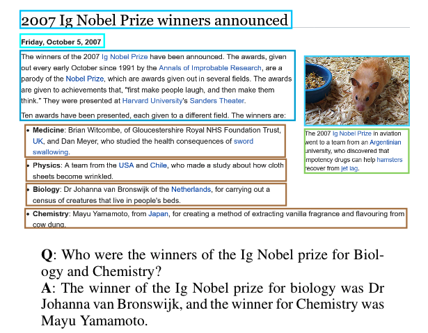

# VisualMRC
VisualMRC is a visual machine reading comprehension dataset that proposes a task: given a question and a document image, a model produces an abstractive answer.

You can find more details, analyses, and baseline results in our [paper](http://arxiv.org/abs/2101.11272 "VisualMRC: Machine Reading Comprehension on Document Images
"). You can cite it as follows:
<pre>
@inproceedings{VisualMRC2021,
  author    = {Ryota Tanaka and
               Kyosuke Nishida and
               Sen Yoshida},
  title     = {VisualMRC: Machine Reading Comprehension on Document Images},
  booktitle = {AAAI},
  year      = {2021}
}
</pre>

# 📢 News
- [2025.03.27] Our VisualMRC dataset is available on 🤗[HuggingFace](https://huggingface.co/datasets/NTT-hil-insight/VisualMRC).

# Download
- 🤗[VisualMRC](https://huggingface.co/datasets/NTT-hil-insight/VisualMRC)

# Statistics
- 10,197 images
- 30,562 QA pairs
- 10.53 average question tokens (tokenizing with NLTK tokenizer)
- 9.53 average answer tokens (tokenizing wit NLTK tokenizer) 
- 151.46 average OCR tokens (tokenizing with NLTK tokenizer)

